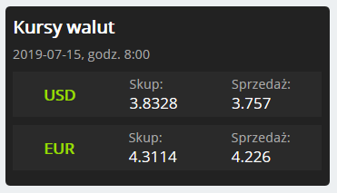

# kurs_nbp
`kurs_nbp` is a simple Drupal 8 module for fetching exchange rates from NBP (Narodowy Bank Polski).

It provides customizable block for displaying selected exchange rates.

## Installation
To install the module, follow these steps:
1. [Download](https://github.com/vllur/kurs_nbp/archive/master.zip) latest .zip (or .tar.gz) archive.
1. In your Drupal website, go to `Manage > Extend > Install new module`.
1. Drag the archive file on the `Browse...` button or select it by file dialogue.
1. Click `install`.
1. Navigate to `Manage > Extend` and type in the search box "Kurs NBP".
1. Check the box near the module name, and click `Install`.

Now you can start using it. If you got stuck on anything, check the [Troubleshooting]() section of this readme.

To uninstall the module, go to `Manage > Extend`, select "Uninstall" tab and remove it.

For complete removal you can delete the `kurs_nbp` (or `kurs_nbp-master`) directory from your Drupal installation - you can probably find it in `htdocs/modules`.

## Usage
After a succesful installation, you can make use of the new 'Kurs NBP' block in your website.

To do this, navigate to `Manage > Structure > Block layout` and press `Place block` button near the name of section where you want to put your block.

Now find "Kurs NBP" block and press `Place block` near it - a popup will show up, allowing you to manipulate the properties of this block instance - see [Variables]() below.

After you have done configuring, press `Save block`. Now you can go back to home page of your site and see the exchange rates.

For now, you an place as many blocks as you want, however they will share the same style - different currencies works fine.

### Variables
To customize your block, you can modify the default values of the currencies and style fields.

#### Currencies
*Type space separated currencies. Default: "USD EUR"*

This field can be feed with any number of vaild three letter currency names, case insensitive.

#### Style
*Choose between "light" or "dark". Default: "dark"*

This field takes only two strings - 'light' or 'dark'. It changes the color scheme of all 'Kurs NBP' blocks if all of them have the same setting.

## Files
`src/Plugin/Block/KursBlock.php` is the main source file. It contains logic of both input and output, as well as manipulating the data.

`config/install/kurs.nbp.settings.yml` is holding the default values for user input.

`css/` directory contains all styling.

`css/KursBlock.css` - here you can find all styling, except the colors.

`css/dark.css` - colors for the dark style.

`css/light.css` - colors for the light style.

## Troubleshooting
If something goes wrong, follow these steps:
 - clear all cache - you can do it either from the admin panel (`Configuration > Development > Performance`, `Clear all caches` button), or via drush (`drush cr`)
 - uninstall module, clear the cache and install it again

If it does not solve your problem, feel free to post an [issue](https://github.com/vllur/kurs_nbp/issues/new) describing the situation.

## Contributing
If you have an idea or you have found a bug, open an [issue](https://github.com/vllur/kurs_nbp/issues/new).

## License
This repository and its content are under the terms of MIT license. See [LICENSE](LICENSE) for more information.
